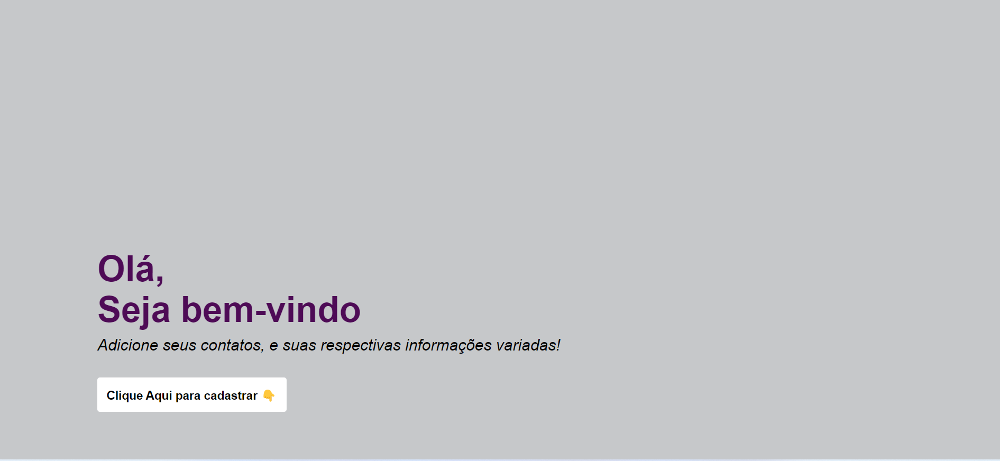
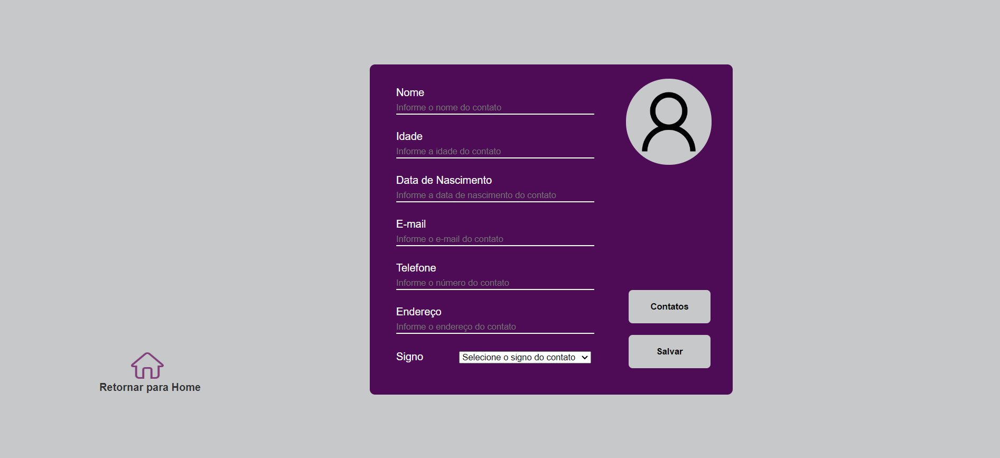
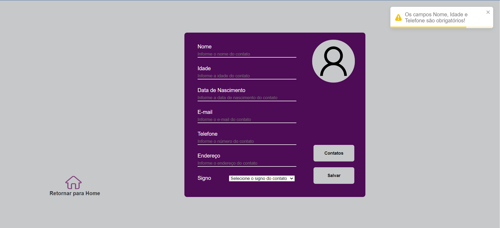
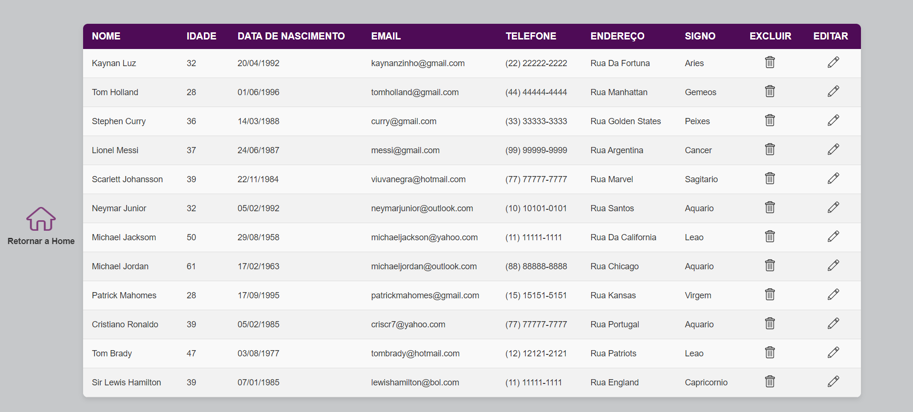
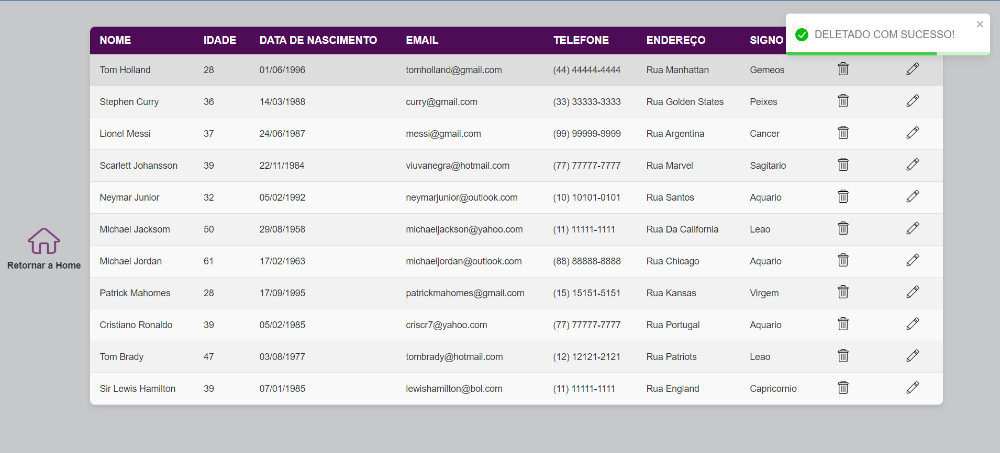
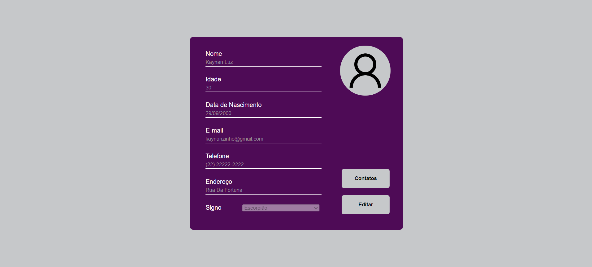
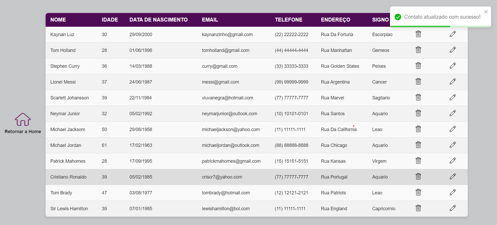

# Agenda App

Gerenciador de contatos, onde o usuário pode registrar alguns dados sobre o indivíduo, como nome, idade, telefone e entre outros. Facilitando o acervo de dados em um único lugar, ou para backup, para uma possível perda em outros ambientes.

## Sumário

1. [Descrição](#descrição)
2. [Home](#home)
3. [Cadastro](#cadastro)
4. [Lista de Contatos](#lista-de-contatos)
5. [Edição](#edição)
6. [Instalação](#instalação)<br/>
6.1 [Pré-requisitos](#pré-requisitos)<br/>
6.2 [Instalando pré-requisito](#instalando-pré-requisitos)<br>
6.3 [Clonando projeto](#clonando-projeto)<br>
6.4 [Rodando Projeto](#rodar-projeto)<br>
6.5 [Testando Projeto](#testar-e-rodar-projeto)
7. [Considerações Finais](#considerações-finais)
8. [Contato](#contato)
## Descrição

Este projeto foi criado com o intuito de colocar em prática tecnologias estudadas como: HTML, CSS, Javascript, React e Firebase. Foi realizado para avaliar o entendimento técnico prévio. O mesmo conta com quatro telas basicamente, sendo uma "Home", logo após a tela de "cadastro" de dados do usuário, uma tela contendo os "contatos cadastrados" e uma tela de "Edição" dos contatos.

## Home

Tela de Boas vindas do App:



A mesma conta com um botão, onde ao clica-lo a tela se redireciona para fase de cadastro de informações do usuário.

## Cadastro

Tela de Cadastro de usuário:

Basicamente se tem nesta tela um formulário contendo os respectivos campos, e dois botões: "Contatos", que leva o usuário para lista de contatos salvos. E o botão "Salvar" que ao preencher os campos o mesmo serve para salvar o novo contato.



Nessa tela é onde está disponível os campos para criar um contato novo, mas vale ressaltar que existe uma regra, onde caso o usuário queira cadastrar um contato e não informe seu nome, idade ou telefone, o mesmo é informado através de um alerta e não deixa cadastrar, até conter os dados desejados.



Aqui é o exemplo de caso de sucesso, onde o alerta sinaliza que foi cadastrado o contato corretamente, e direciona automaticamente para a lista de contatos.


## Lista de Contatos

Tela onde se encontra a lista de contatos cadastrados e suas respectivas informações: 



Nesta tela podemos ver que ao lado de cada contato temos um ícone de uma lixeira, onde ao clica-lo o contato é excluído e logo após a tela é recarregada atualizando os dados.



## Edição

Na lista de contatos, também se tem um ícone em forma de lápis ao lado de cada contato, que ao clica-lo o mesmo direciona para a tela de edição trazendo os dados preenchido em seus respectivos campos.



Pode se notar que os campos estão bloqueados ao entrar, mas caso o usuário queira realmente atualizar os dados desejados, o mesmo deve selecionar a opção editar, assim os campos bloqueados passam a ser desbloqueados e aceitam serem atualizados. E por fim para salvar a edição, basta clicar em "Atualizar", salvando o progresso.



## Instalação

Para utilizar o projeto em sua máquina, basta seguir o passo-a-passo a seguir:

## Pré-requisitos

### Node.js e npm<br/>
O primeiro pré-requisito é ter o Node.js instalado, já que o projeto usa bibliotecas do ecossistema npm (Node Package Manager).

O npm é o gerenciador de pacotes que acompanha o Node.js e é usado para instalar as dependências listadas em package.json.

Como verificar se está instalado: Digite os comandos abaixo no seu terminal.

```bash
node -v
npm -v
```
Se não estiver instalado, você pode baixá-lo de [nodejs.org](https://nodejs.org/pt).

### Dependências do Projeto<br/>

Estas são as dependências listadas na seção "dependencies" do package.json. Elas serão instaladas automaticamente ao rodar o comando npm install, mas aqui está um resumo do que cada uma faz:

+ @testing-library/jest-dom: Extensões para o Jest que ajudam a testar componentes React, adicionando matchers específicos para testes de DOM.
+ @testing-library/react: Ferramentas para testar componentes React de forma acessível e sem renderizar no DOM real.
+ @testing-library/user-event: Ferramenta para simular interações de usuário (como cliques e teclas) em testes.
+ firebase: Integração com o Firebase, uma plataforma do Google que oferece serviços como banco de dados, autenticação, e armazenamento.
+ react: Biblioteca principal para construir interfaces de usuário.
+ react-dom: Ferramenta que permite que o React interaja com o DOM (Document Object Model).
+ react-router-dom: Biblioteca para gerenciar rotas de navegação em um aplicativo React.
+ react-scripts: Ferramentas e scripts de configuração para rodar, compilar e testar aplicativos React criados com create-react-app.
+ react-toastify: Biblioteca para exibir notificações do tipo "toast" em um aplicativo React.
+ web-vitals: Ferramenta para medir métricas de performance essenciais da web (como tempo de carregamento e interatividade).

### Versão do React 

O projeto está usando a versão 18.3.1 do React, então qualquer novo desenvolvedor ou colaborador precisa garantir que as dependências sejam instaladas corretamente para rodar essa versão: https://react.dev/versions

## Instalando Pré-requisitos

### Instale o Node.js e npm:

A maneira mais fácil de instalar o Node.js é baixá-lo diretamente do site oficial: https://nodejs.org/pt .

## Clonando Projeto

### Instale o Git

+ Se você ainda não tem o Git instalado, primeiro faça o download e instale-o a partir do site oficial: https://git-scm.com/.

Após a instalação, você pode verificar se está funcionando corretamente executando o seguinte comando no terminal:

```bash
 git --version
```

Isso deve retornar a versão do Git instalada.

### Clonar o Repositório
Agora, você precisa clonar o repositório para a sua máquina.

Como clonar o repositório:<br>

+ Vá para o repositório GitHub que você deseja clonar.<br>
+ Clique no botão verde "Code".<br>
+ Escolha a URL para clonar via HTTPS (ou SSH, se você tiver configurado chaves SSH).<br>
+ No terminal, execute o seguinte comando:

```bash
 git clone https://github.com/usuario/repositorio.git
```
Substitua a URL anterior pela URL copiada.

### Exemplo:
Se você deseja clonar um repositório de exemplo chamado "projeto-exemplo", o comando será:

```bash
git clone https://github.com/usuario/projeto-exemplo.git
```
Isso criará uma cópia local do repositório na sua máquina.

### Instale Dependências

Aqui esta o exemplo de como instalar dependências do projeto:

```bash
npm install
```

## Rodar Projeto

Após instalar todas as dependências, você pode rodar o projeto.

```bash
npm start
```

## Testar e Rodar Projeto

Depois de rodar os comandos acima, você deve ser capaz de acessar o projeto localmente (através do navegador web). O URL comum é http://localhost:3000.

### Resumo dos Passos

1. Instale o Git (se ainda não tiver).<br>
2. Clone o repositório usando o comando git clone URL_DO_REPOSITORIO.<br>
3. Instale as dependências (por exemplo, npm install).
4. Rode o projeto (npm start).<br>

Seguindo esses passos, você terá o projeto clonado na sua máquina e rodando corretamente.


## Considerações Finais

Este projeto foi realizado com o intuito de pôr em prática o conteúdo estudado anteriormente através da internet. O projeto se encontra em fase inicial tendo várias ideias para melhorias no futuro. Agradeço desde já, as visualizações e feedbacks para melhorias do mesmo.

## Contato

Segue abaixo minhas informações para contato:

+ Email: kaynanhp@hotmail.com   
+ LinkedIn: https://www.linkedin.com/in/kaynan-padilha-36a54b221/